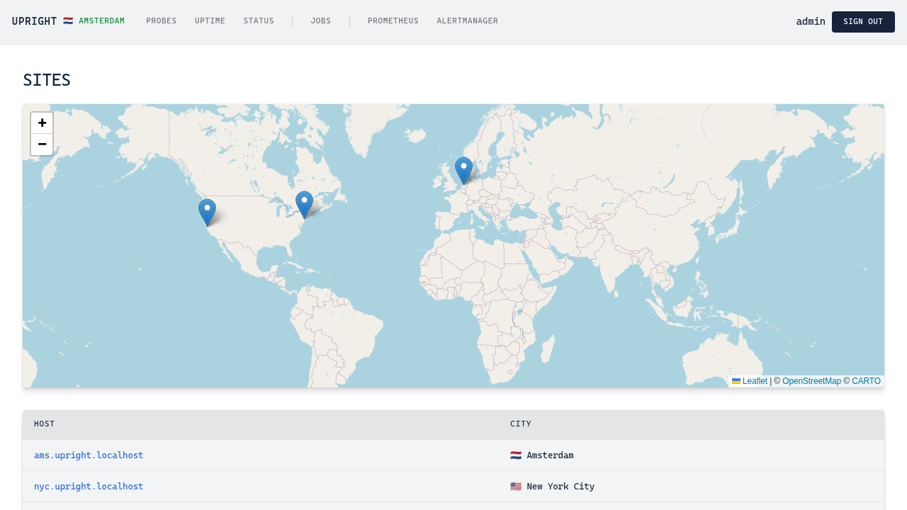
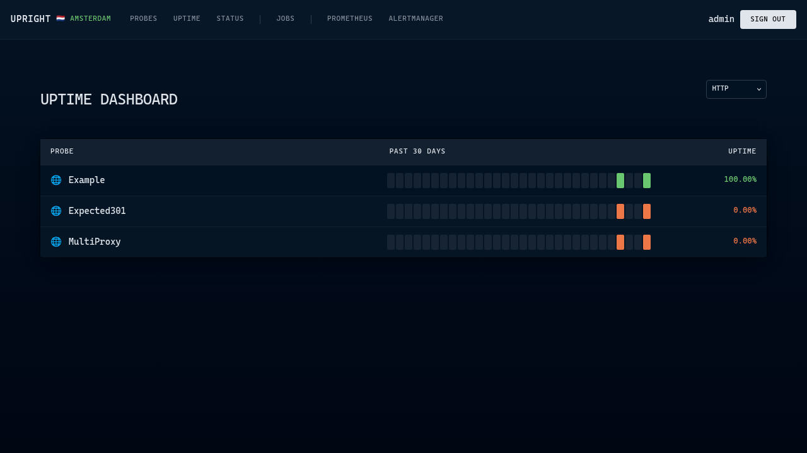
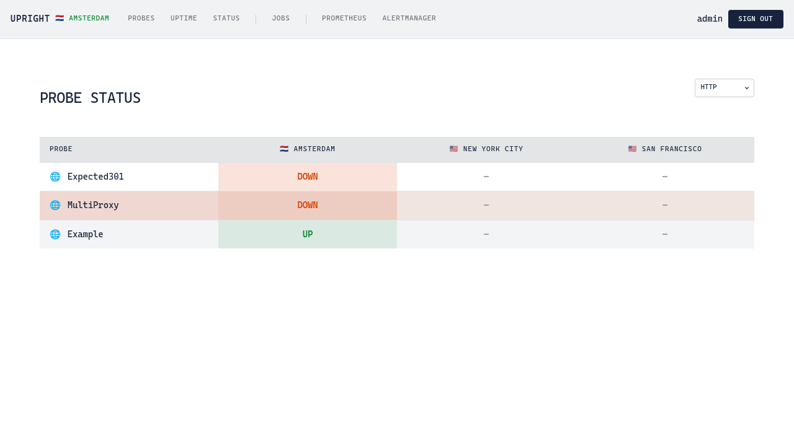

# Upright

Upright is a self-hosted synthetic monitoring system. It provides a framework for running health check probes from multiple geographic sites and reporting metrics via Prometheus. Alerts can then be configured with AlertManager.

<table>
  <tr>
    <td></td>
    <td></td>
  </tr>
  <tr>
    <td><em>Site overview with world map</em></td>
    <td><em>30-day uptime history</em></td>
  </tr>
  <tr>
    <td colspan="2"></td>
  </tr>
  <tr>
    <td colspan="2"><em>Probe status across all sites</em></td>
  </tr>
</table>

## Features

- **Playwright Probes** - Browser-based probes for user flows with video recording and logs
- **HTTP Probes** - Simple HTTP health checks with configurable expected status codes
- **SMTP Probes** - EHLO handshake verification for mail servers
- **Traceroute Probes** - Network path analysis with hop-by-hop latency tracking
- **Multi-Site Support** - Run probes from multiple geographic locations with staggered scheduling
- **Observability** - OTLP compatible, Prometheus metrics, OpenTelemetry tracing, and AlertManager support
- **Configurable Authentication** - OmniAuth integration with support for any OIDC provider

### Not Included

- **Notifications** - Instead, Alertmanager is included for alerting and notifications
- **Hosting** - Instead, you can use a VPS from DigitalOcean, Hetzner, etc.

### Components

- Rails engine
- SQLite
- Solid Queue for background and recurring jobs
- Mission Control - Jobs to monitor Solid Queue and manually enqueue probes
- Kamal for deployments
- Prometheus metrics for uptime queries and alerting
- AlertManager for notifications
- Open Telemetry Collector - logs, metrics and traces can be shipped to any OTLP compatible endpoint

## Installation

> [!NOTE]
> Upright is designed to be run in its own Rails app and deployed with Kamal.

### Quick Start (New Project)

Create a new Rails application and install Upright:

```bash
rails new my-upright --database=sqlite3 --skip-test
cd my-upright
bundle add upright
bin/rails generate upright:install
bin/rails db:migrate
```

Start the server:

```bash
bin/dev
```

Visit http://app.my-upright.localhost:3000 to see your Upright instance.

> **Note**: Upright uses subdomain-based routing. The `app` subdomain is the admin interface, while site-specific subdomains (e.g., `nyc`, `lon`) show probe results for each location. The `.localhost` TLD resolves to 127.0.0.1 on most systems.

### What the Generator Creates

The `upright:install` generator creates:

- `config/initializers/upright.rb` - Engine configuration
- `config/sites.yml` - Site definitions for each VPS you host Upright on
- `config/prometheus/prometheus.yml` - Prometheus configuration
- `config/alertmanager/alertmanager.yml` - AlertManager configuration
- `config/otel_collector.yml` - OpenTelemetry Collector configuration
- `probes/` - Directory for all HTTP, SMTP, Traceroute YAML config as well as Playwright probe classes

It also mounts the engine at `/` in your routes.

## Configuration

### Basic Setup

See `config/initializers/upright.rb`

### Hostname Configuration

Upright uses subdomain-based routing. Configure your production hostname:

```ruby
# config/initializers/upright.rb
Upright.configure do |config|
  config.hostname = "upright.com"
end
```

For local development, the hostname defaults to `{service_name}.localhost` (e.g., `upright.localhost`).

### Site Configuration

Define your monitoring locations in `config/sites.yml`:

```yaml
shared:
  sites:
    - code: nyc
      city: New York City
      country: US
      geohash: dr5reg
      provider: digitalocean

    - code: ams
      city: Amsterdam
      country: NL
      geohash: u17982
      provider: digitalocean

    - code: sfo
      city: San Francisco
      country: US
      geohash: 9q8yy
      provider: hetzner
```

Each site node identifies itself via the `SITE_SUBDOMAIN` environment variable, configured in your Kamal deploy.yml.

### Authentication

#### Static Credentials

Upright uses static credentials by default with username `admin` and password `upright`.

> [!WARNING]
> Change the default password before deploying to production by setting the `ADMIN_PASSWORD` environment variable.


#### OpenID Connect

For production environments, Upright supports OpenID Connect (Logto, Keycloak, Duo, Okta, etc.):

```ruby
# config/initializers/upright.rb
Upright.configure do |config|
  config.auth_provider = :openid_connect
  config.auth_options = {
    issuer: "https://your-tenant.logto.app/oidc",
    client_id: ENV["OIDC_CLIENT_ID"],
    client_secret: ENV["OIDC_CLIENT_SECRET"]
  }
end
```

## Defining Probes

### HTTP Probes

Add probes to `probes/http_probes.yml`:

```yaml
- name: Main Website
  url: https://example.com
  expected_status: 200

- name: API Health
  url: https://api.example.com/health
  expected_status: 200

- name: Admin Panel
  url: https://admin.example.com
  basic_auth_credentials: admin_auth  # Key in Rails credentials
```

### SMTP Probes

Add probes to `probes/smtp_probes.yml`:

```yaml
- name: Primary Mail Server
  host: mail.example.com

- name: Backup Mail Server
  host: mail2.example.com
```

### Playwright Probes

Generate a new browser-based probe:

```bash
bin/rails generate upright:playwright_probe MyServiceAuth
```

This creates a probe class:

```ruby
# probes/my_service_auth_probe.rb
class Probes::Playwright::MyServiceAuthProbe < Upright::Probes::Playwright::Base
  # Optionally authenticate before running
  # authenticate_with_form :my_service

  def check
    page.goto("https://app.example.com")
    page.fill('[name="email"]', "test@example.com")
    page.click('button[type="submit"]')
    page.wait_for_selector(".dashboard")
  end
end
```

See https://playwright-ruby-client.vercel.app/docs/api/page for how to create Playwright tests.

#### Creating Authenticators

For probes that require authentication, create an authenticator:

```ruby
# probes/authenticators/my_service.rb
class Playwright::Authenticator::MyService < Upright::Playwright::Authenticator::Base
  def signin_redirect_url = "https://app.example.com/dashboard"
  def signin_path = "/login"
  def service_name = :my_service

  def authenticate
    page.goto("https://app.example.com/login")
    page.get_by_label("Email").fill(credentials.my_service.email)
    page.get_by_label("Password").fill(credentials.my_service.password)
    page.get_by_role("button", name: "Sign in").click
  end
end
```

## Scheduling

Configure probe scheduling with Solid Queue in `config/recurring.yml`:

```yaml
production:
  http_probes:
    command: "Upright::Probes::HTTPProbe.check_and_record_all_later"
    schedule: every 30 seconds

  smtp_probes:
    command: "Upright::Probes::SMTPProbe.check_and_record_all_later"
    schedule: every 30 seconds

  my_service_auth:
    command: "Probes::Playwright::MyServiceAuthProbe.check_and_record_later"
    schedule: every 15 minutes
```

## System Requirements

### Minimum VM Specifications

| Resource | Minimum | Recommended |
|----------|---------|-------------|
| CPU | 2 vCPU | 2 vCPU |
| RAM | 2 GB | 4 GB |
| Disk | 25 GB | 50 GB |

Playwright browser automation is memory-intensive. For sites running many Playwright probes concurrently, consider 4 GB RAM.

### Software Requirements

- **OS**: Ubuntu 24.04+ or Debian 12+ (any Linux with Docker support)
- **Docker**: 24.0+ (installed automatically by Kamal)
- **Ruby**: 3.4+ (for local development only; production runs in Docker)
- **Rails**: 8.0+


### Firewall Rules

Open the following ports:

| Port | Protocol | Direction | Purpose |
|------|----------|-----------|---------|
| 22 | TCP | Inbound | SSH access |
| 80 | TCP | Inbound | HTTP (redirects to HTTPS) |
| 443 | TCP | Inbound | HTTPS |
| 25 | TCP | Outbound | SMTP probes (if used) |

### SMTP Port 25 Note

Most cloud providers block outbound port 25 by default to prevent spam. If you plan to use SMTP probes, you must request port 25 to be unblocked.

This is not required for HTTP or Playwright probes.

## DNS Setup

For multiple geographic locations, use subdomains for each site. Each subdomain points to a different server:

```
; Primary dashboard
app.upright.example.com      A    203.0.113.10

; Monitoring nodes
ams.upright.example.com      A    203.0.113.10    ; Amsterdam
nyc.upright.example.com      A    198.51.100.20   ; New York
sfo.upright.example.com      A    192.0.2.30      ; San Francisco
```

## Deployment with Kamal

### Example `config/deploy.yml`

```yaml
service: upright
image: your-org/upright

servers:
  web:
    hosts:
      - ams.upright.example.com: [amsterdam]
      - nyc.upright.example.com: [new_york]
      - sfo.upright.example.com: [san_francisco]
  jobs:
    hosts:
      - ams.upright.example.com: [amsterdam]
      - nyc.upright.example.com: [new_york]
      - sfo.upright.example.com: [san_francisco]
    cmd: bin/jobs

proxy:
  app_port: 3000
  ssl: true
  hosts:
    - "*.upright.example.com"

env:
  secret:
    - RAILS_MASTER_KEY
  tags:
    amsterdam:
      SITE_SUBDOMAIN: ams
    new_york:
      SITE_SUBDOMAIN: nyc
    san_francisco:
      SITE_SUBDOMAIN: sfo

accessories:
  playwright:
    image: jacoblincool/playwright:chromium-server-1.55.0
    port: "127.0.0.1:53333:53333"
    roles:
      - jobs

  prometheus:
    image: prom/prometheus:v3.2.1
    hosts:
      - ams.upright.example.com
    cmd: >-
      --config.file=/etc/prometheus/prometheus.yml
      --storage.tsdb.path=/prometheus
      --storage.tsdb.retention.time=30d
      --web.enable-otlp-receiver
    files:
      - config/prometheus/prometheus.yml:/etc/prometheus/prometheus.yml
      - config/prometheus/rules/upright.rules.yml:/etc/prometheus/rules/upright.rules.yml

  alertmanager:
    image: prom/alertmanager:v0.28.1
    hosts:
      - ams.upright.example.com
    cmd: --config.file=/etc/alertmanager/alertmanager.yml
    files:
      - config/alertmanager/alertmanager.yml:/etc/alertmanager/alertmanager.yml
```

## Observability

### Prometheus

Metrics are exposed via a Puma plugin at `http://0.0.0.0:9394/metrics`. Configure Prometheus to scrape:

```yaml
scrape_configs:
  - job_name: upright
    static_configs:
      - targets: ['localhost:9394']
```

### Metrics Exposed

- `upright_probe_duration_seconds` - Probe execution duration
- `upright_probe_up` - Probe status (1 = up, 0 = down)
- `upright_http_response_status` - HTTP response status code

Labels include: `type`, `name`, `site_code`, `site_city`, `site_country`

### AlertManager

Example alert rules (`prometheus/rules/upright.rules`):

```yaml
groups:
  - name: upright
    rules:
      - alert: ProbeDown
        expr: upright_probe_up == 0
        for: 5m
        labels:
          severity: critical
        annotations:
          summary: "Probe {{ $labels.name }} is down"
```

### OpenTelemetry

Traces are automatically created for each probe execution. Configure your collector endpoint:

```ruby
Upright.configure do |config|
  config.otel_endpoint = "https://otel.example.com:4318"
end
```

## Local Development

### Setup

```bash
bin/setup
```

This installs dependencies, prepares the database, and starts the dev server.

### Running Services

Start supporting Docker services (Playwright server, etc.):

```bash
bin/services
```

### Running the Server

```bash
bin/dev
```

Visit http://app.upright.localhost:3000 and sign in with:
- **Username**: `admin`
- **Password**: `upright` (or value of `ADMIN_PASSWORD` env var)

### Testing Playwright Probes

Run probes with a visible browser window:

```bash
LOCAL_PLAYWRIGHT=1 bin/rails console
```

```ruby
Probes::Playwright::MyServiceAuthProbe.check
```

### Running Tests

```bash
bin/rails test
```

## License

The gem is available under the terms of the [MIT License](LICENSE.md).
